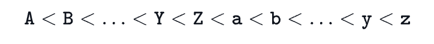
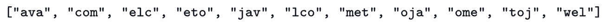

# Substring Comparisons

We define the following terms:

Lexicographical Order, also known as alphabetic or dictionary order, orders characters as follows:



For example, `ball < cat`, `dog < dorm`, `Happy < happy`, `Zoo < ball`.


A substring of a string is a contiguous block of characters in the string. For example, the substrings of `abc` are `a`, `b`, `c`, `ab`, `bc`, and `abc`.

Given a string, `s`, and an integer, `k`, complete the function so that it finds the lexicographically smallest and largest substrings of length `k`.

## Function Description
Complete the `getSmallestAndLargest` function

`getSmallestAndLargest` has the following parameters:
- string `s`: a string
- int `k`: the length of the substrings to find

## Input Format
The first line contains a string denoting `s`
The second line contains an integer denoting `k`

## Constraints
- `1 <= |s| <= 1000`
- `s` consists of English alphabetic letters only (i.e., `[a-zA-Z]`)

## Sample Input
```
welcometojava
3
```
## Sample Output
```
ava
wel
```
## Explanation
String `s = "welcometojava"` has the following lexicographically-ordered substrings of length `k=3`:



We then return the first (lexicographically smallest) substring and the last (lexicographically largest) substring as two newline-separated values (i.e., `ava\nwel`).
